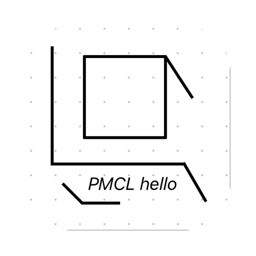

# PMCL

<p align="center">
  
</p>

<p align="center">
  
</p>

**PMCL** (Personal Minecraft Custom Launcher) 是一个基于 Compose Desktop 构建的跨平台 Minecraft 启动器，采用 Material 3 设计语言，内置插件系统、联机功能、模组管理，并支持嵌入 HMCL JavaFX 界面。

## 功能特性

### 启动器核心
- **Compose Desktop UI** — Material 3 设计，流畅的动画和平滑滚动
- **版本安装与启动** — 支持从 Alpha 到最新正式版的 Minecraft 版本
- **微软账户认证** — OAuth 2.0 Device Code 流程登录
- **Java 运行时管理** — 自动检测/下载 Java 8/17/21，Apple Silicon 支持 x86_64 兼容层
- **跨平台** — macOS (arm64/x86_64)、Windows (x64)、Linux
- **GitHub Release 同步更新** — 直接轮询 GitHub Releases API，发现新版本主动通知（见下文）

### 内容管理
- **模组管理** — Modrinth / CurseForge 模组市场集成，冲突检测
- **整合包支持** — 自动扫描 modpack 版本的 mods 目录
- **世界与截图** — 合并 PMCL / HMCL / 官方启动器目录，去重展示
- **数据包 / 光影包 / 资源包** — 一键安装与管理

### 联机
- **多后端支持** — Terracotta / EasyTier / ConnectX
- **房间系统** — 创建/加入房间，状态机管理，房间码唯一性保证
- **中继连接** — 稳定的中继服务器，低丢包率

### 插件系统
- **.ppk 包格式** — 严格规范的 ZIP 包，包含 plugin.xml 清单
- **多语言源码** — Kotlin（主逻辑）+ Java（辅助功能）+ XML（信息说明）
- **13 条验证规则** — 路径前缀、文件扩展名、唯一主标记、版本匹配等
- **插件能力** — 注册命令、GUI 页面、启动钩子、事件监听器
- **安全默认** — 命令名黑名单（56 个保留字）、zip-slip 防护

### 终端模式
- **35 条命令** — 版本管理、模组操作、联机、Java 管理、Wiki 搜索等
- **全英文界面** — 命令历史 (↑/↓)、彩色输出、自动滚动
- **GUI 终端** — 内嵌在侧边栏的完整终端体验

### JavaFX UI 嵌入插件
- **JavaFX in Compose** — 通过 JFXPanel + SwingPanel 将 JavaFX UI 嵌入 Compose Desktop
- **Scene Stealing** — 反射调用 `Launcher.start(stage)`，拦截 `show()` 窃取 Scene

## 项目结构

```
PMCL/
├── core/                    # 核心逻辑 (Java)
│   └── src/main/java/com/pmcl/core/
│       ├── auth/            # 微软账户认证
│       ├── download/        # 下载管理器 (支持 curl fallback)
│       ├── install/         # 版本安装器
│       ├── launch/          # 启动管理器 (Java 架构检测)
│       ├── market/          # Modrinth/CurseForge 客户端
│       ├── mods/            # 模组扫描与管理
│       ├── multiplayer/     # 联机 (Terracotta/EasyTier/ConnectX)
│       ├── plugin/          # 插件包构建器
│       ├── update/          # 自更新 + GitHub Release 同步 (GitHubReleaseSyncChecker)
│       └── ...
├── ui/                      # Compose Desktop UI (Kotlin)
│   └── src/commonMain/kotlin/com/pmcl/ui/
│       ├── page/            # 22 个页面 (启动/新闻/联机/下载/内容/存档...)
│       ├── animation/       # 平滑滚动与过渡动画
│       ├── theme/           # Material 3 主题
│       └── App.kt           # 主应用入口
├── cli/                     # 命令行接口 (Java, 35 条命令)
├── plugin-api/              # 插件 API (Kotlin)
│   └── src/main/kotlin/com/pmcl/plugin/
│       ├── PmclPlugin.kt    # 插件接口
│       ├── PluginContext.kt # 插件上下文 (注册命令/页面/钩子)
│       └── PluginPackageParser.kt  # .ppk 解析器 (13 条规则)
├── hmcl-plugin/             # 嵌入插件
│   ├── lib/                 # JavaFX 25 jars
│   └── src/main/kotlin/com/pmcl/hmcl/
│       ├── HmclEmbedder.kt  # JavaFX 初始化 + Scene 窃取
│       └── HmclPageContent.kt  # Compose UI + SwingPanel
├── custom-downloader-plugin/  # 自定义下载器插件示例
├── test-plugin/             # 单 JAR 插件示例
├── test-plugin-package/     # .ppk 包插件示例
└── settings.gradle.kts      # 8 个子模块
```

## 技术栈

| 组件 | 技术 |
|------|------|
| UI 框架 | Compose Multiplatform 1.7.0 |
| 语言 | Kotlin 2.0.21 / Java 21 |
| 构建工具 | Gradle 8.10 (Kotlin DSL) |
| 序列化 | Gson 2.11 + kotlinx.serialization |
| 网络 | OkHttp 4.12 (支持 curl fallback) |
| 系统信息 | OSHI 6.6.5 |
| JavaFX | OpenJFX 25 (mac arm64) |

## 快速开始

### 环境要求
- JDK 21+
- Gradle 8.10+（项目已包含 gradlew）

### 构建

```bash
# 构建 Fat JAR（Compose 原生库较全，但 JavaFX 原生库与构建主机一致）
./gradlew :ui:fatJar

# 输出: ui/build/libs/pmcl-1.3.0-all.jar
# 运行: java -jar ui/build/libs/pmcl-1.3.0-all.jar
```

### 构建原生安装包

```bash
# 当前系统的原生安装包（macOS: pkg/dmg，Windows: msi/exe，Linux: deb/rpm）
./gradlew :ui:packageDistributionForCurrentOS

# 发布构建可用 packageReleasePkg / packageReleaseMsi / packageReleaseDeb 等任务
```

### 构建插件

```bash
./gradlew :hmcl-plugin:ppk
# 输出: hmcl-plugin/build/distributions/hmcl-embed-1.0.0.ppk

# 自定义下载器插件
./gradlew :custom-downloader-plugin:ppk
# 输出: custom-downloader-plugin/build/distributions/custom-downloader-1.1.0.ppk
```

## 插件开发

### 最小示例

```kotlin
class MyPlugin : PmclPlugin {
    override val pluginId = "my-plugin"

    override fun onEnable(ctx: PluginContext) {
        // 注册终端命令
        ctx.registerCommand("hello", "Say hello") { args ->
            "Hello, ${args.firstOrNull() ?: "World"}!"
        }

        // 注册 GUI 页面 (侧边栏)
        ctx.registerPage("my-page", "My Page", MyPageContent())
    }
}
```

### .ppk 包格式

```
my-plugin-1.0.0.ppk
├── plugin.xml                          # 清单 (信息 + 版本控制)
├── META-INF/
│   └── pmcl-plugin.properties          # 插件描述符
├── classes/                            # 编译后的 .class 文件 (必需)
├── lib/                                # 依赖 JAR (可选)
├── resources/                          # 资源文件 (可选)
└── src/
    ├── kt/                             # Kotlin 源码 (文档)
    └── java/                           # Java 源码 (文档)
```

### 安装插件

```bash
# Shell 终端
plugin package /path/to/plugin.ppk

# GUI 终端
plugin package /absolute/path/to/plugin.ppk
```

插件安装到 `~/.pmcl/plugins/<id>/`，支持 zip-slip 防护。

## 侧边栏导航

| 图标 | 页面 | 功能 |
|------|------|------|
| PlayArrow | 启动 | 版本选择、启动游戏、状态监控 |
| Info | 新闻 | Minecraft.net RSS 新闻 |
| Share | 联机 | Terracotta/EasyTier 房间 |
| Build | 下载 | 版本安装 / 模组市场 / Wiki |
| Star | 内容 | 模组 / 光影包 / 资源包 |
| Search | 存档 | 世界 / 截图 |
| Person | 账号 | 微软账户管理 |
| Settings | 设置 | 主题、下载源、启动器配置 |
| Terminal | 终端 | 35 条命令的 Shell |
| Extension | 插件 | 插件管理 + 插件页面 |

## 工程要点

- **Java 架构检测** — 通过 `java -XshowSettings:properties -version` 检测实际架构，Apple Silicon 优先选择 `natives-*-arm64`
- **旧版本兼容** — 1.12.2 及更早版本强制使用 Java 8（LaunchWrapper 依赖 URLClassLoader）
- **macOS .jnilib** — 旧版 LWJGL 2.x 使用 .jnilib，Java 9+ 需要 .dylib 副本
- **curl Fallback** — GFW 干扰 Java TLS 指纹时自动回退到系统 curl 子进程
- **代理复用** — 所有网络客户端复用 DownloadManager 的 OkHttpClient，继承用户代理配置
- **Modpack gameDir** — 整合包的 gameDir 必须设为版本目录本身，而非 mcRoot
- **Fat JAR module-info** — 排除所有 module-info.class 避免 Java 21 命名模块问题

## GitHub Release 同步更新

PMCL 每次启动都会访问 GitHub Releases API 检查一次最新版本。周期同步开关默认关闭；用户开启后，每 30 分钟追加检查一次。发现新版本时会选择当前操作系统/架构对应的安装包，用户确认后完成下载、摘要与签名校验，并在退出当前进程后自动安装、重启。

### 架构

```
GitHub Releases API  ◀──启动检查/可选周期轮询──  PMCL 客户端
   │                                            │
   │ Release 含 pkg/msi/deb/rpm/平台 JAR 资产   │
   ▼                                            ▼
平台/架构选择 + 版本比较 + 签名资产匹配     发现新版本 → 弹窗询问用户
                                                   │
                                                   ▼
                                      下载并校验 SHA-256 + Ed25519
                                      退出后安装并重新启动
```

- **启动检查** — 无论周期同步是否开启，每次打开 PMCL 都检查一次
- **周期同步** — 默认关闭；开启后启动 5 秒内检查，之后每 30 分钟检查
- **版本比较** — 取 Release 的 `tag_name`（去掉 `v` 前缀），按点分段比较数字大小
- **资产识别** — macOS 优先 `.pkg/.dmg`，Windows 优先 `.msi/.exe`，Linux 优先 `.deb/.rpm/AppImage`，缺失时仅回退 OS/架构匹配的 JAR；旧版无平台标记 JAR 优先级最低
- **安全校验** — 安装包必须有 GitHub SHA-256 digest 和对应的 `.sig` Ed25519 签名资产
- **速率限制处理** — 未认证 GitHub API 限 60 次/小时；触发限制后自动延长到 2 小时间隔，通过 `X-RateLimit-Remaining` header 检测

### 发布新版本

仓库内置 `.github/workflows/release-desktop.yml`。推送 `v*` tag 后会分别构建 macOS PKG、Windows MSI、Linux DEB/RPM，以及各构建主机对应的 OS/架构 JAR，并上传每个安装包及其同名 `.sig`。

发布仓库必须配置 Actions Secret：

- `PMCL_UPDATE_ED25519_PRIVATE_KEY`：与客户端内置公钥配对的 Base64 PKCS#8 Ed25519 私钥

工作流通过 `tools/SignUpdateAsset.java` 对版本、下载 URL、SHA-256 和文件大小的规范载荷签名。缺少密钥或签名时发布任务会失败，客户端也会拒绝安装。

### 启动器端配置

1. 打开 PMCL → 设置 → 滚动到底部"GitHub Release 同步"卡片
2. 默认仓库为 `PCML-Z/PCML`；也可填入其他 `owner/repo`
3. “立即检查”不要求开启周期同步
4. 开启“GitHub Release 自动同步”后，每 30 分钟自动检查
5. 卡片下方状态指示灯显示检查与同步状态

发现新版本时，启动器任意页面都会弹出版本、平台构建、更新说明和大小。选择“下载并自动安装”后，文件先保存到 `~/.pmcl/updates/` 并完成双重校验；随后辅助安装进程接管，PMCL 优雅退出、安装对应系统构建并重新打开。系统安装包可能触发管理员授权。

### GitHub API 速率限制

未认证的 GitHub REST API 限制为 60 次/小时。PMCL 每 30 分钟轮询一次（2 次/小时），正常使用不会触及限制。若因其他原因触发限制：

- 检测到 `X-RateLimit-Remaining: 0` 时，自动将轮询间隔延长到 2 小时
- 恢复后自动回到 30 分钟的正常间隔
- 状态栏会显示"GitHub API 速率限制，120分钟后重试"

## 许可证

本项目仅供学习和个人使用。

Minecraft 是 Mojang Studios 的商标。请确保您拥有合法的 Minecraft 副本。

## 致谢

- [Compose Multiplatform](https://github.com/JetBrains/compose-multiplatform) — JetBrains
- [Modrinth](https://modrinth.com) — 模组市场 API
- [CurseForge](https://www.curseforge.com) — 模组市场 API
- [Terracotta](https://maven.terraformersmc.com) — 联机后端
